<div align="center">
  
  <h1>Afya Yangu <br> <span style="font-size: 1.2rem; color: #666;">Version 2.0</span></h1>
  <p>Your Modern, Intuitive Health Companion.</p>

<p>
    
    
    
    
</p>
</div>

Welcome to **Afya Yangu**, a comprehensive and user-friendly mobile application designed to empower you to take control of your health in Kenya. With a completely redesigned interface, seamless light and dark themes, and a host of new features, managing your health has never been easier or more intuitive.

This application is built with Flutter and GetX for a high-performance, cross-platform experience.

## ✨ Key Features in Version 2.0

- **Sleek, Modern UI**: A completely refreshed user interface that is both beautiful and easy to navigate.
- **Dynamic Theming**: Instantly switch between light and dark modes for a comfortable viewing experience, day or night.
- **Custom Fonts**: Enhanced readability and a polished look with newly integrated custom fonts.
- **Comprehensive Health Dashboard**: Get an at-a-glance overview of your health, including vital signs and upcoming appointments.
- **Detailed Health Overview**: Dive deeper into your health metrics with detailed charts and historical data.
- **Full Appointment Management**: Schedule, view, and manage all your doctor's appointments in one place.
- **Personalized Profile**: Customize your profile, including the ability to upload a profile picture.
- **Complete Medical History**: Access your medical records, medication history, and hospital visits anytime.

## 📸 Application Screenshots

### Onboarding & Authentication

Simple and secure onboarding process gets you started in no time.

| Splash Screen | Onboarding 1 | Onboarding 2 | Onboarding 3 |
| :---: | :---: | :---: | :---: |
| 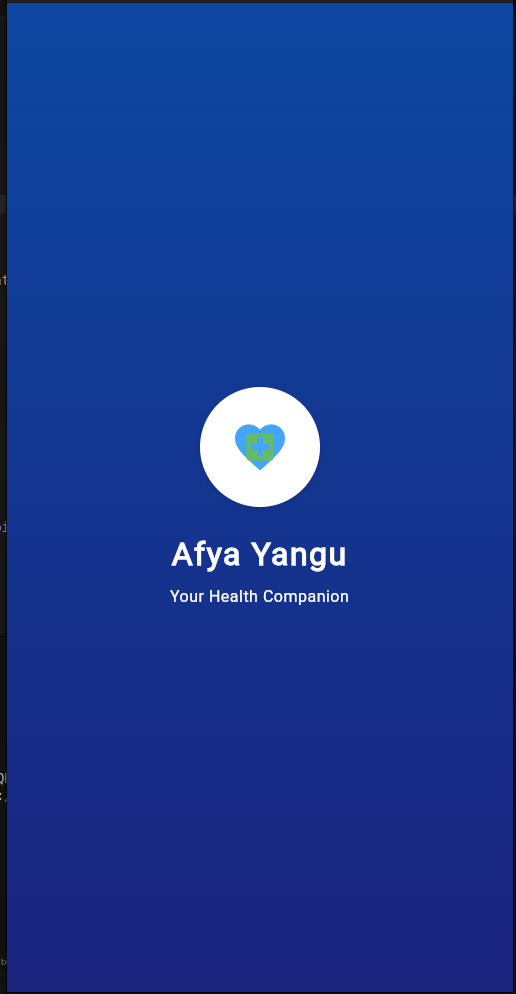 | 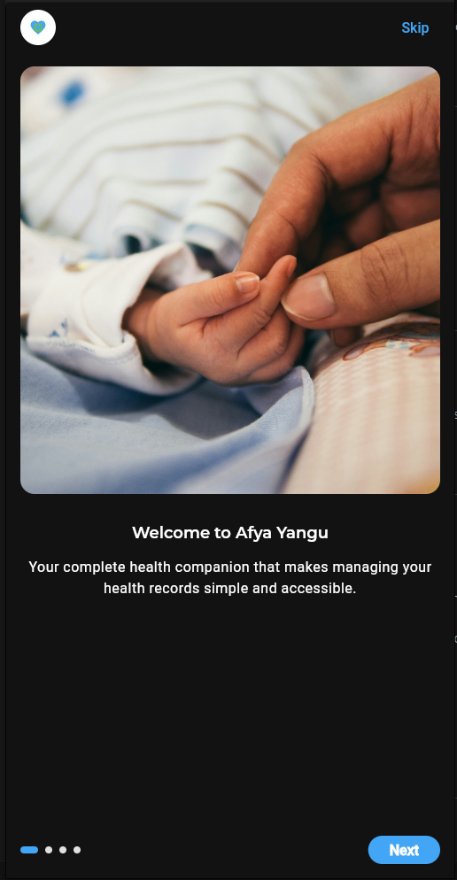 | 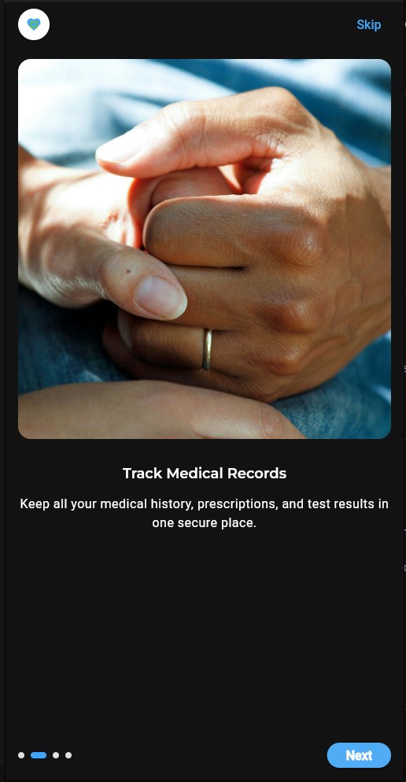 | 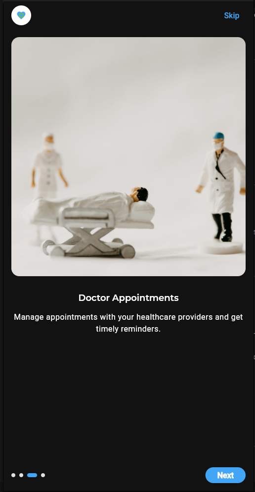 |

| Onboarding 4 | Login | Sign Up |
| :---: | :---: | :---: |
| 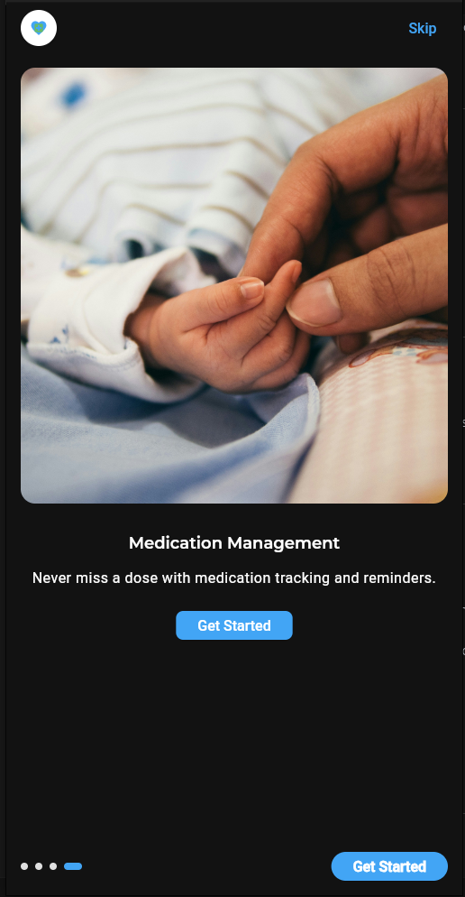 | 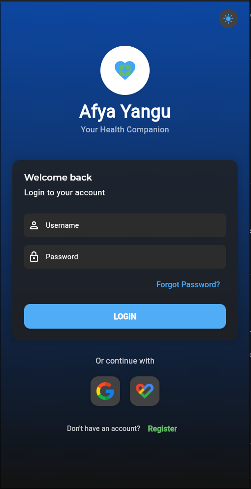 | 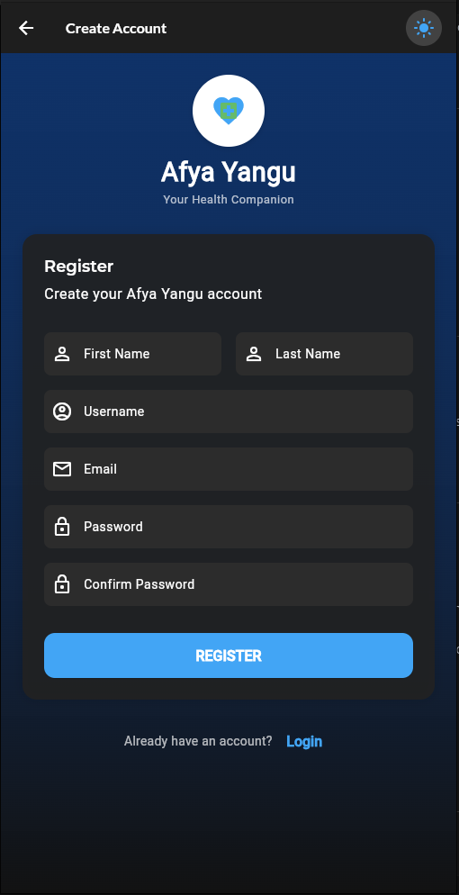 |

---

### Core Application Pages

| Dashboard | Profile | Health Overview |
| :---: | :---: | :---: |
| 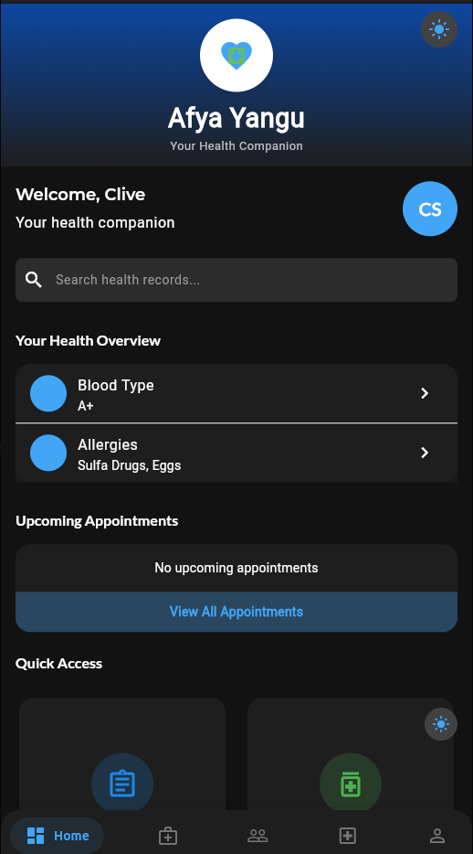 | 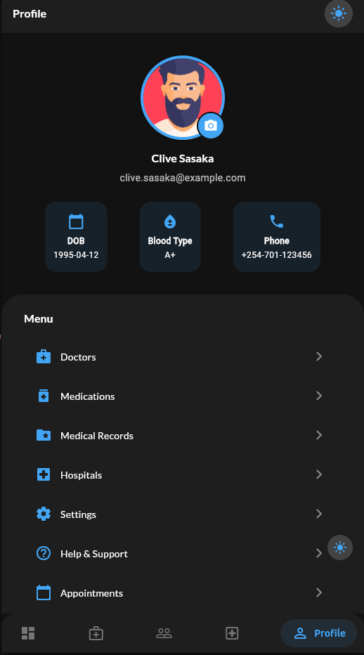 | 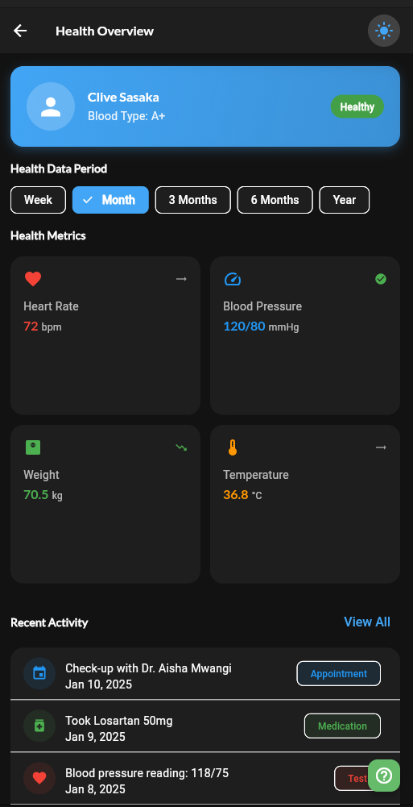 |

| Appointments | Medical Records | Medications |
| :---: | :---: | :---: |
| 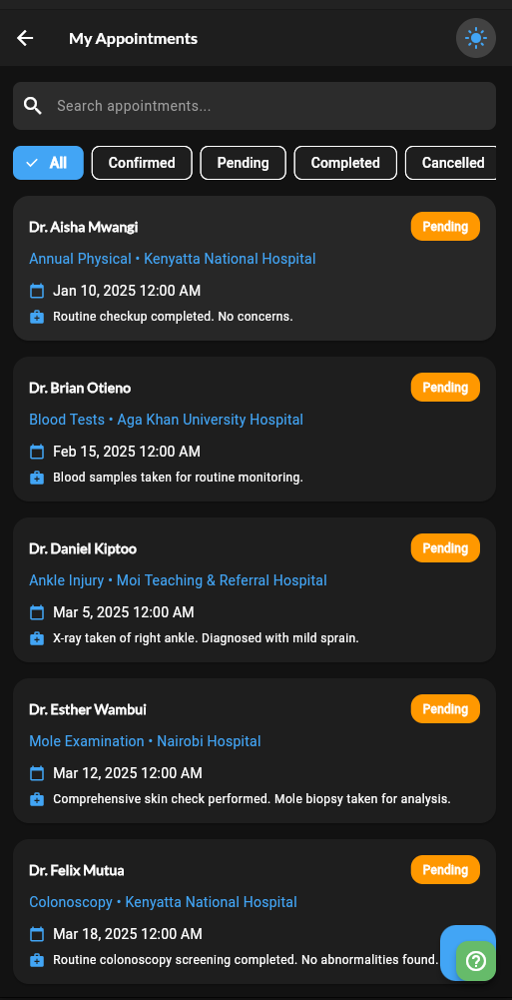 | 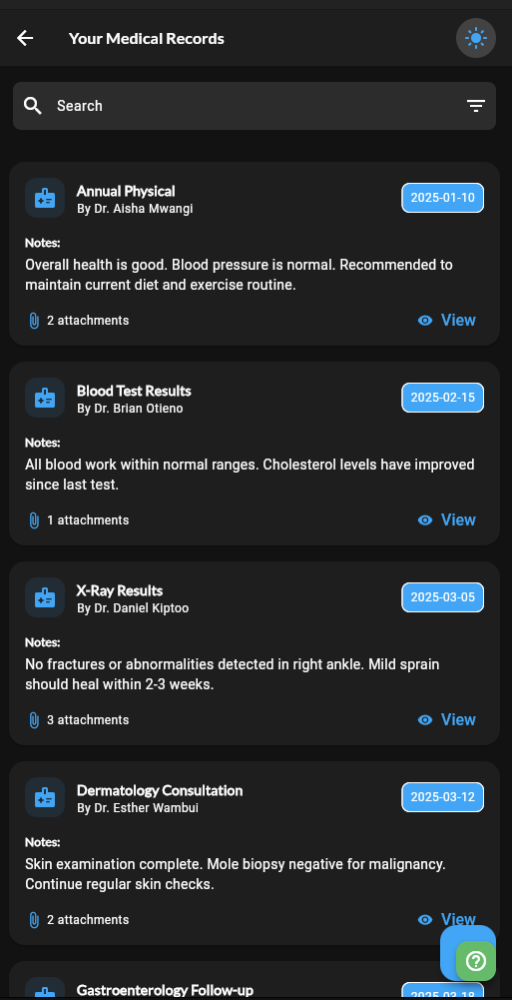 | 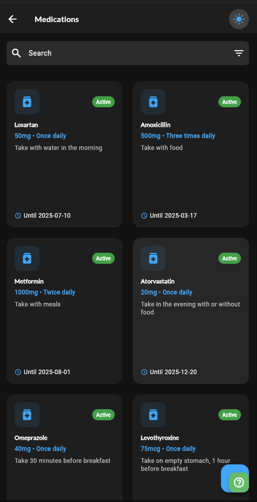 |

| Doctors | Hospitals | Hospital Visits |
| :---: | :---: | :---: |
| 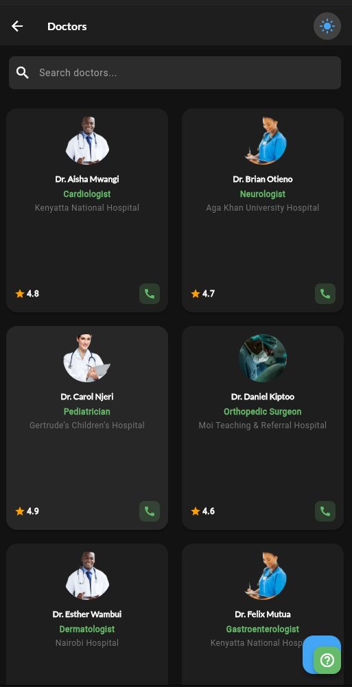 | 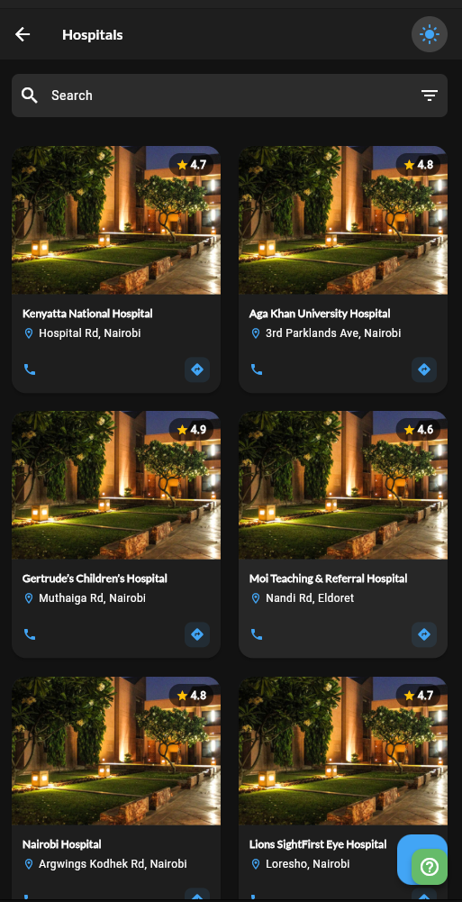 | 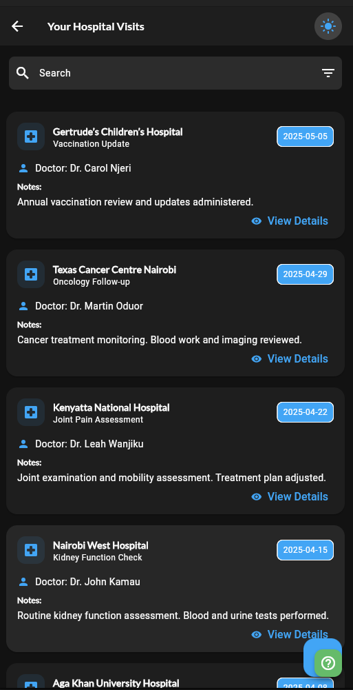 |

| Recommendations | Help & Support |
| :---: | :---: |
| 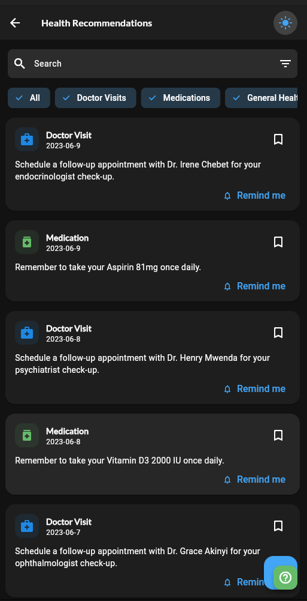 | 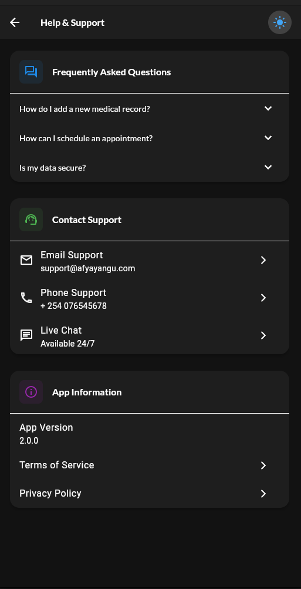 |

## 🚀 Getting Started

To get a local copy up and running, follow these simple steps.

### Prerequisites

- Flutter SDK
- An editor like VS Code or Android Studio

### Installation

1. Clone the repo
   ```sh
   git clone https://github.com/your-username/afya-yangu.git
   ```
2. Install packages
   ```sh
   flutter pub get
   ```
3. Run the app
   ```sh
   flutter run
   ```

## 🤝 Contributing

Contributions are what make the open-source community such an amazing place to learn, inspire, and create. Any contributions you make are **greatly appreciated**.

If you have a suggestion that would make this better, please fork the repo and create a pull request. You can also simply open an issue with the tag "enhancement".
Don't forget to give the project a star! Thanks again!

1. Fork the Project
2. Create your Feature Branch (`git checkout -b feature/AmazingFeature`)
3. Commit your Changes (`git commit -m 'Add some AmazingFeature'`)
4. Push to the Branch (`git push origin feature/AmazingFeature`)
5. Open a Pull Request

## 📄 License

Distributed under the MIT License. See `LICENSE` for more information.

---

<p align="center">Made with ❤️ for a healthier tomorrow.</p>
