# Patient Tracker Flutter Application

Welcome to the Patient Tracker Flutter Application! This application helps users keep track of their medical records, appointments, and health-related information conveniently.

## Table of Contents

1. [About](#about)
2. [Features](#features)
3. [Installation](#installation)
4. [Usage](#usage)
5. [Contributing](#contributing)
6. [Screenshots](#screenshots)
7. [Disclaimer](#disclaimer)
8. [License](#license)

## About

The Patient Tracker Flutter Application is designed to provide users with a seamless experience in managing their health-related data. Whether it's tracking hospital visits, managing medical records, or scheduling appointments, this application aims to simplify the process and enhance user convenience.

## Features

- **Hospital Visits**: Keep track of past hospital visits with detailed information.
- **Medical Records**: Maintain a digital record of medical history and diagnoses.
- **Appointment Scheduling**: Schedule and manage appointments with healthcare providers.
- **User Authentication**: Secure login and registration system to protect user data.
- **Confidentiality**: Assured confidentiality of user information to maintain privacy.
- **User-Friendly Interface**: Intuitive design and smooth navigation for a seamless user experience.

## Installation

To install the Patient Tracker Flutter Application, follow these steps:

1. Clone the repository: `git clone https://github.com/Csasaka19/patient_tracker.git`
2. Navigate to the project directory: `cd patient_tracker`
3. Install dependencies: `flutter pub get`
4. Run the application: `flutter run`

## Usage

To use the Patient Tracker Flutter Application, simply launch the app on your device or emulator. Log in or register to access the main dashboard, where you can start managing your health-related data. Follow the intuitive interface to navigate between features and utilize the app's functionalities.

## Contributing

I welcome contributions from the community to enhance the Patient Tracker Flutter Application. To contribute, follow these steps:

1. Fork the repository.
2. Create a new branch: `git checkout -b feature_name`
3. Make your changes and commit them: `git commit -m 'Add some feature'`
4. Push to the branch: `git push origin feature_name`
5. Submit a pull request.

## Screenshots

### Onboarding

    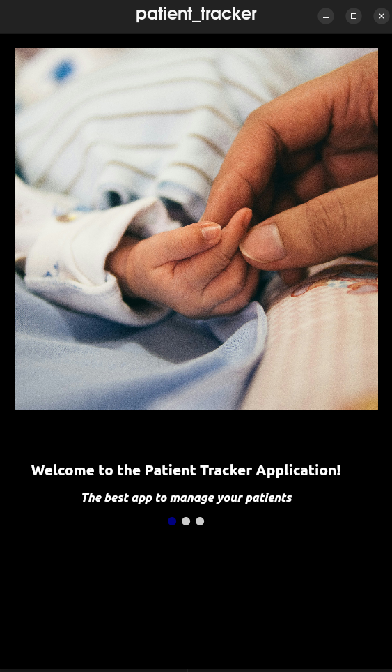
    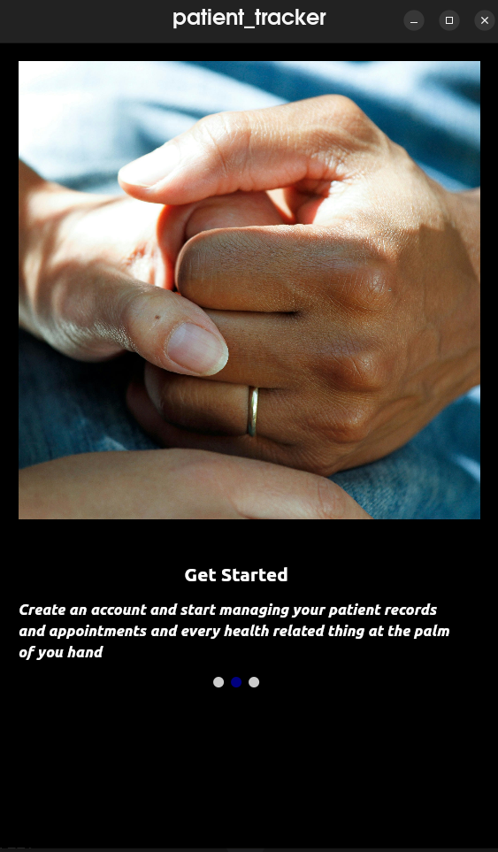
    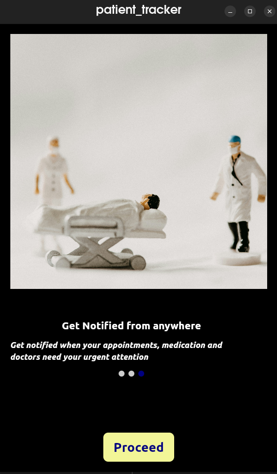

*Welcome to Patient Tracker! Get started with our easy-to-follow onboarding process.*

### Profile Page

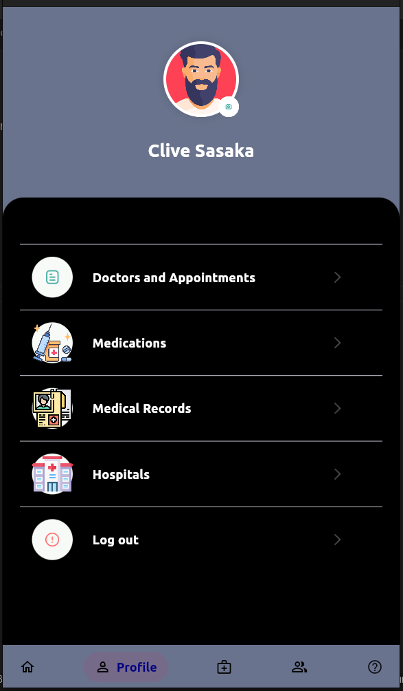
*View and manage your profile details with ease.*

### Welcome Page

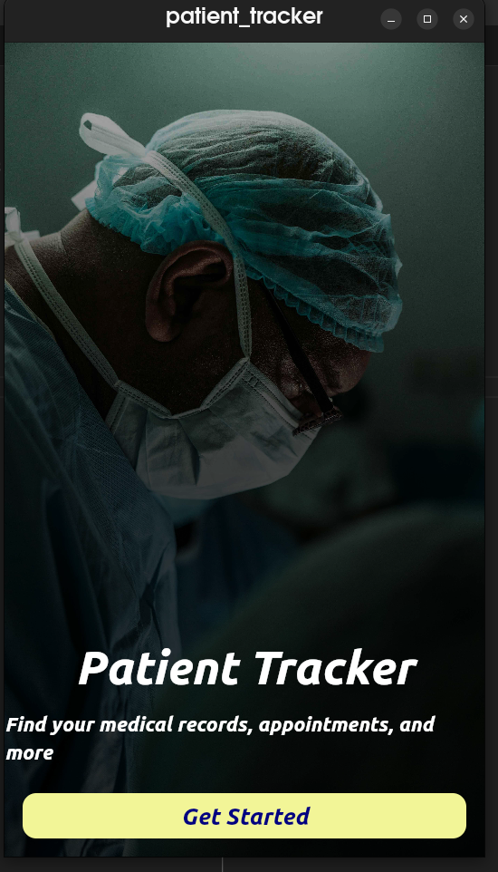
*Experience a warm welcome every time you launch the app.*

### Registration

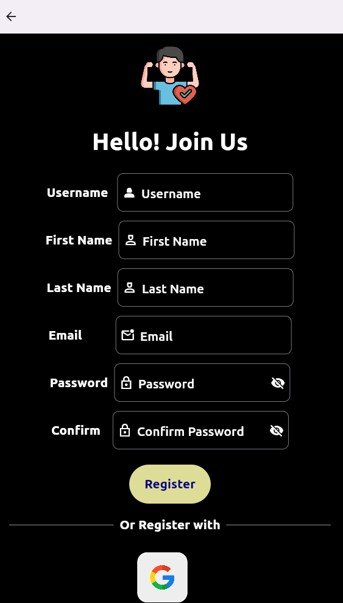
*Join the Patient Tracker community by registering for an account.*

### Login

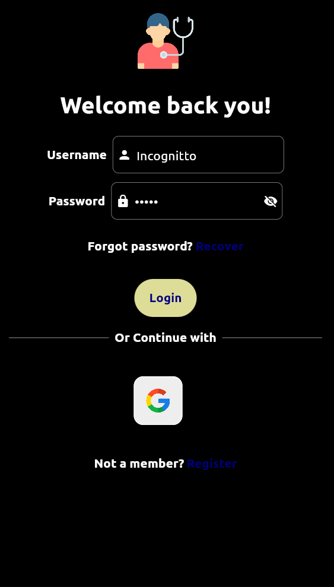
*Securely log in to your account to access personalized features.*

### Dashboard

    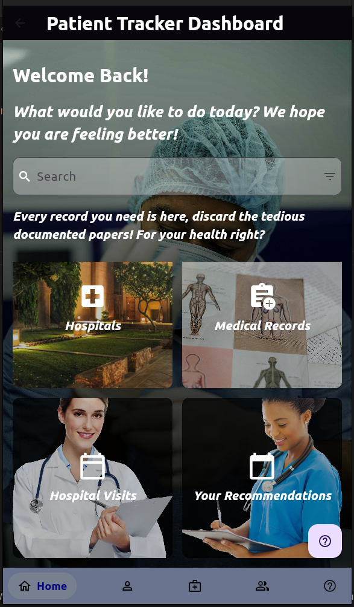
    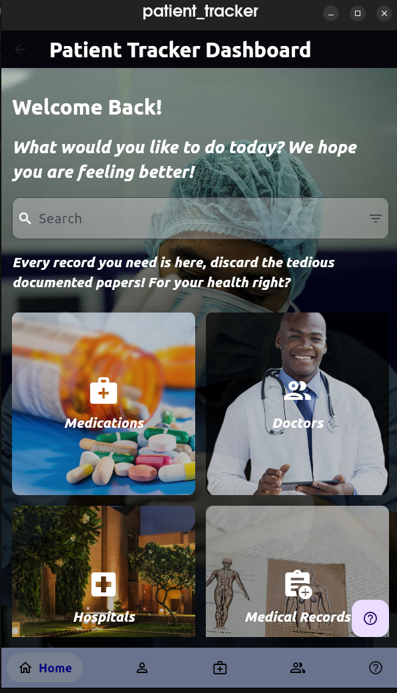

*Stay organized with a comprehensive dashboard displaying all your health-related data.*

### Browse

    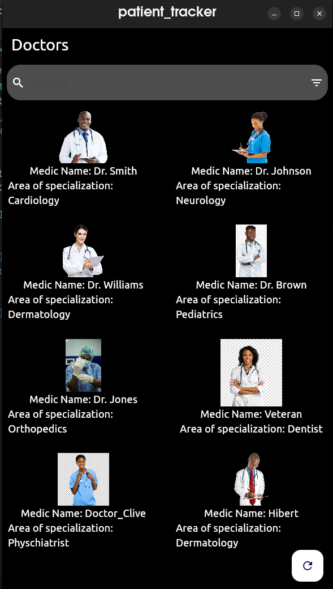
    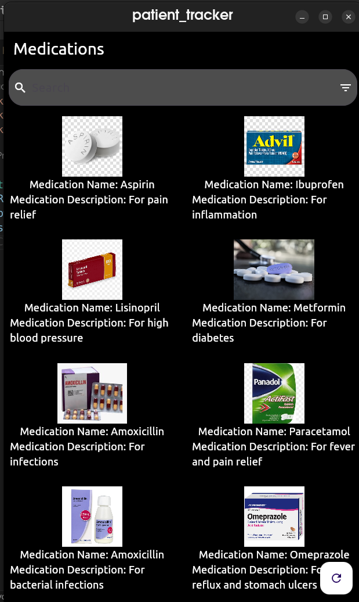
    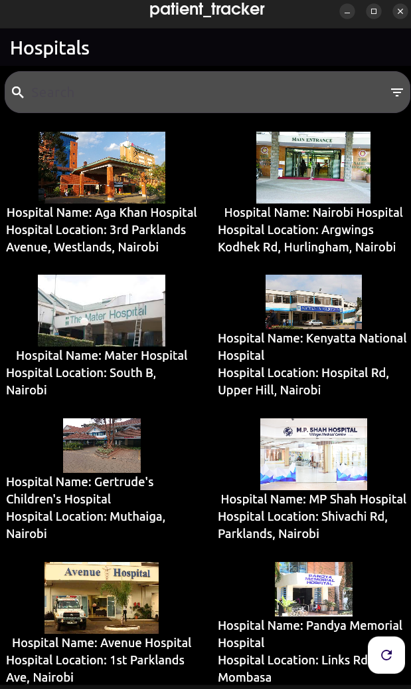

*Browse and be informed about doctors, medications and hospitals.*

### Sample Fetched Data

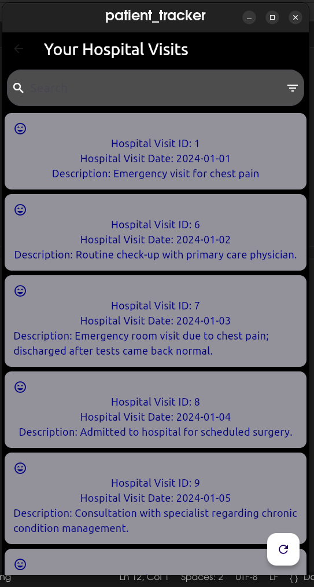
*Example of fetched data showcasing hospital visits, medical records, and appointments.*

## Disclaimer

Make your own relevant backend using a relevant technology.

## License

This project is licensed under the [MIT License](LICENSE).
